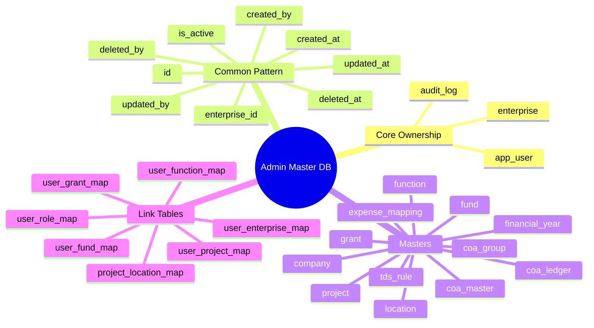

# Admin Master Database Design

## Purpose

This document defines a decoupled database design for the Admin module master tables.
The design goal is to keep data levels as basic as possible, remove denormalized text dependencies, and make every record tenant-aware and user-aware.

It covers:

- Admin master tables currently used in the project
- New core ownership tables: `enterprise` and `app_user`
- Standard base columns for all tables
- Soft-delete design using `is_active`
- Audit logging for insert, update, and delete events
- Suggested normalized relationships for future implementation

## Current Admin Module Scope

Based on the current application, the Admin module includes these master datasets:

- User Master
- Company Master
- Location Master
- Fund Master
- Function Master
- Project Master
- Financial Year Master
- Grant Master
- TDS Master
- Expense Mapping Master
- Chart of Accounts

## Design Principles

1. Every business record belongs to an `enterprise`.
2. Every insert/update/delete action is attributable to a user.
3. Hard delete should be avoided for master data.
4. Master tables should use IDs for relationships, not free-text codes stored everywhere.
5. Codes can remain as business identifiers, but foreign keys should use surrogate keys.
6. Audit logs must store both the action and the before/after snapshot.
7. Active/inactive should be explicit using `is_active`.

## Mind Map

## Standard Base Columns

These columns should exist in almost every master and transaction table.

| Column | Data type | Required | Notes |
|---|---|---:|---|
| `id` | `bigint` or `uuid` | Yes | Primary key |
| `enterprise_id` | `bigint` or `uuid` | Yes | FK to `enterprise.id` |
| `is_active` | `boolean` | Yes | `true` = active, `false` = inactive / soft deleted |
| `created_at` | `timestamp` | Yes | Insert timestamp |
| `created_by` | `bigint` or `uuid` | Yes | FK to `app_user.id` |
| `updated_at` | `timestamp` | Yes | Last update timestamp |
| `updated_by` | `bigint` or `uuid` | Yes | FK to `app_user.id` |
| `deleted_at` | `timestamp` | No | Filled only on soft delete |
| `deleted_by` | `bigint` or `uuid` | No | Filled only on soft delete |
| `remarks` | `varchar(500)` | No | Optional common notes |

## Core Tables

### 1. `enterprise`

This is the top-level tenant / legal entity master.

| Column | Data type | Required | Notes |
|---|---|---:|---|
| `id` | `bigint` / `uuid` | Yes | PK |
| `enterprise_code` | `varchar(50)` | Yes | Unique business code |
| `enterprise_name` | `varchar(200)` | Yes | Legal / reporting name |
| `enterprise_type` | `varchar(50)` | No | NGO, Trust, Company, Section 8, etc. |
| `pan` | `varchar(20)` | No | Tax identifier |
| `tan` | `varchar(20)` | No | Tax deduction identifier |
| `gstin` | `varchar(20)` | No | GST registration |
| `csr1_no` | `varchar(50)` | No | CSR registration |
| `incorporation_no` | `varchar(100)` | No | Registration number |
| `registered_under` | `varchar(150)` | No | Act / authority |
| `eighty_g_no` | `varchar(100)` | No | 80G number |
| `eighty_g_valid_till` | `date` | No | 80G expiry |
| `twelve_a_no` | `varchar(100)` | No | 12A number |
| `twelve_a_valid_till` | `date` | No | 12A expiry |
| `fcra_no` | `varchar(100)` | No | FCRA number |
| `fcra_valid_till` | `date` | No | FCRA expiry |
| `darpan_id` | `varchar(100)` | No | NGO Darpan ID |
| `contact_no` | `varchar(30)` | No | Contact number |
| `email` | `varchar(150)` | No | Official email |
| `website` | `varchar(250)` | No | Website |
| `address_line1` | `varchar(250)` | No | Address |
| `address_line2` | `varchar(250)` | No | Address |
| `city` | `varchar(100)` | No | Address city |
| `state` | `varchar(100)` | No | Address state |
| `postal_code` | `varchar(20)` | No | PIN / ZIP |
| `country` | `varchar(100)` | No | Usually India |
| `is_active` | `boolean` | Yes | Soft delete marker |
| `created_at` | `timestamp` | Yes | Audit |
| `created_by` | `bigint` / `uuid` | Yes | Audit |
| `updated_at` | `timestamp` | Yes | Audit |
| `updated_by` | `bigint` / `uuid` | Yes | Audit |
| `deleted_at` | `timestamp` | No | Soft delete |
| `deleted_by` | `bigint` / `uuid` | No | Soft delete |

### 2. `app_user`

User master should not store direct free-text references to fund, grant, function, and project. Those should move to mapping tables.

| Column | Data type | Required | Notes |
|---|---|---:|---|
| `id` | `bigint` / `uuid` | Yes | PK |
| `enterprise_id` | `bigint` / `uuid` | Yes | FK |
| `user_code` | `varchar(50)` | No | Optional employee/user code |
| `full_name` | `varchar(150)` | Yes | Display name |
| `email` | `varchar(150)` | Yes | Unique within enterprise |
| `mobile_no` | `varchar(30)` | No | Optional |
| `user_type` | `varchar(30)` | Yes | Employee, Consultant, etc. |
| `login_name` | `varchar(100)` | No | If separate from email |
| `password_hash` | `varchar(255)` | No | If login is internal |
| `status` | `varchar(30)` | Yes | Active, Inactive, Locked |
| `last_login_at` | `timestamp` | No | Optional |
| `is_active` | `boolean` | Yes | Soft delete marker |
| `created_at` | `timestamp` | Yes | Audit |
| `created_by` | `bigint` / `uuid` | Yes | Audit |
| `updated_at` | `timestamp` | Yes | Audit |
| `updated_by` | `bigint` / `uuid` | Yes | Audit |
| `deleted_at` | `timestamp` | No | Soft delete |
| `deleted_by` | `bigint` / `uuid` | No | Soft delete |

## Supporting User Mapping Tables

Instead of storing one text value in user master like `fund = "GF-01"` or `proj = "SOL-1"`, use mapping tables.

### `user_enterprise_map`

| Column | Data type | Required | Notes |
|---|---|---:|---|
| `id` | `bigint` / `uuid` | Yes | PK |
| `user_id` | `bigint` / `uuid` | Yes | FK to `app_user.id` |
| `enterprise_id` | `bigint` / `uuid` | Yes | FK to `enterprise.id` |
| `is_default` | `boolean` | Yes | Default working enterprise |
| `is_active` | `boolean` | Yes | Active mapping |
| `created_at` | `timestamp` | Yes | Audit |
| `created_by` | `bigint` / `uuid` | Yes | Audit |
| `updated_at` | `timestamp` | Yes | Audit |
| `updated_by` | `bigint` / `uuid` | Yes | Audit |

### `user_role_map`

| Column | Data type | Required | Notes |
|---|---|---:|---|
| `id` | `bigint` / `uuid` | Yes | PK |
| `enterprise_id` | `bigint` / `uuid` | Yes | FK |
| `user_id` | `bigint` / `uuid` | Yes | FK |
| `role_name` | `varchar(50)` | Yes | Admin, Finance, Approver, User |
| `is_active` | `boolean` | Yes | Active mapping |
| `created_at` | `timestamp` | Yes | Audit |
| `created_by` | `bigint` / `uuid` | Yes | Audit |
| `updated_at` | `timestamp` | Yes | Audit |
| `updated_by` | `bigint` / `uuid` | Yes | Audit |

### `user_fund_map`, `user_grant_map`, `user_function_map`, `user_project_map`

All four tables use the same pattern.

| Column | Data type | Required | Notes |
|---|---|---:|---|
| `id` | `bigint` / `uuid` | Yes | PK |
| `enterprise_id` | `bigint` / `uuid` | Yes | FK |
| `user_id` | `bigint` / `uuid` | Yes | FK |
| `<master>_id` | `bigint` / `uuid` | Yes | FK to related master |
| `is_active` | `boolean` | Yes | Active mapping |
| `created_at` | `timestamp` | Yes | Audit |
| `created_by` | `bigint` / `uuid` | Yes | Audit |
| `updated_at` | `timestamp` | Yes | Audit |
| `updated_by` | `bigint` / `uuid` | Yes | Audit |

## Admin Master Tables

### 3. `company`

If the app needs multiple registered companies under one enterprise, keep this separate from `enterprise`. If not, `enterprise` can replace it. Recommended: keep `company` only if one enterprise can manage multiple legal companies.

| Column | Data type | Required | Notes |
|---|---|---:|---|
| `id` | `bigint` / `uuid` | Yes | PK |
| `enterprise_id` | `bigint` / `uuid` | Yes | FK |
| `company_code` | `varchar(50)` | Yes | Unique within enterprise |
| `company_name` | `varchar(200)` | Yes | Legal name |
| `org_type` | `varchar(50)` | No | Trust, Society, etc. |
| `pan` | `varchar(20)` | No | PAN |
| `tan` | `varchar(20)` | No | TAN |
| `gstin` | `varchar(20)` | No | GST |
| `csr1_no` | `varchar(50)` | No | CSR1 |
| `incorporation_no` | `varchar(100)` | No | Registration |
| `registered_under` | `varchar(150)` | No | Act |
| `eighty_g_no` | `varchar(100)` | No | 80G |
| `eighty_g_valid_till` | `date` | No | Expiry |
| `twelve_a_no` | `varchar(100)` | No | 12A |
| `twelve_a_valid_till` | `date` | No | Expiry |
| `fcra_no` | `varchar(100)` | No | FCRA |
| `fcra_valid_till` | `date` | No | Expiry |
| `darpan_id` | `varchar(100)` | No | Darpan |
| `contact_no` | `varchar(30)` | No | Contact |
| `email` | `varchar(150)` | No | Email |
| `website` | `varchar(250)` | No | Website |
| `address` | `text` | No | Registered address |
| `is_active` | `boolean` | Yes | Soft delete |
| `created_at` | `timestamp` | Yes | Audit |
| `created_by` | `bigint` / `uuid` | Yes | Audit |
| `updated_at` | `timestamp` | Yes | Audit |
| `updated_by` | `bigint` / `uuid` | Yes | Audit |
| `deleted_at` | `timestamp` | No | Soft delete |
| `deleted_by` | `bigint` / `uuid` | No | Soft delete |

### 4. `location`

| Column | Data type | Required | Notes |
|---|---|---:|---|
| `id` | `bigint` / `uuid` | Yes | PK |
| `enterprise_id` | `bigint` / `uuid` | Yes | FK |
| `location_code` | `varchar(50)` | Yes | Business code |
| `location_name` | `varchar(150)` | Yes | Office / branch name |
| `region` | `varchar(50)` | No | North, South, etc. |
| `state` | `varchar(100)` | Yes | State |
| `city` | `varchar(100)` | Yes | City / district |
| `address` | `text` | No | Address |
| `is_active` | `boolean` | Yes | Soft delete |
| `created_at` | `timestamp` | Yes | Audit |
| `created_by` | `bigint` / `uuid` | Yes | Audit |
| `updated_at` | `timestamp` | Yes | Audit |
| `updated_by` | `bigint` / `uuid` | Yes | Audit |
| `deleted_at` | `timestamp` | No | Soft delete |
| `deleted_by` | `bigint` / `uuid` | No | Soft delete |

### 5. `fund`

| Column | Data type | Required | Notes |
|---|---|---:|---|
| `id` | `bigint` / `uuid` | Yes | PK |
| `enterprise_id` | `bigint` / `uuid` | Yes | FK |
| `fund_code` | `varchar(50)` | Yes | Unique business code |
| `fund_name` | `varchar(150)` | Yes | Fund name |
| `description` | `varchar(500)` | No | Optional |
| `is_active` | `boolean` | Yes | Soft delete |
| `created_at` | `timestamp` | Yes | Audit |
| `created_by` | `bigint` / `uuid` | Yes | Audit |
| `updated_at` | `timestamp` | Yes | Audit |
| `updated_by` | `bigint` / `uuid` | Yes | Audit |
| `deleted_at` | `timestamp` | No | Soft delete |
| `deleted_by` | `bigint` / `uuid` | No | Soft delete |

### 6. `function_master`

`function` is often a reserved word, so `function_master` is safer.

| Column | Data type | Required | Notes |
|---|---|---:|---|
| `id` | `bigint` / `uuid` | Yes | PK |
| `enterprise_id` | `bigint` / `uuid` | Yes | FK |
| `function_code` | `varchar(50)` | Yes | Unique business code |
| `function_name` | `varchar(150)` | Yes | Function name |
| `description` | `varchar(500)` | No | Optional |
| `is_active` | `boolean` | Yes | Soft delete |
| `created_at` | `timestamp` | Yes | Audit |
| `created_by` | `bigint` / `uuid` | Yes | Audit |
| `updated_at` | `timestamp` | Yes | Audit |
| `updated_by` | `bigint` / `uuid` | Yes | Audit |
| `deleted_at` | `timestamp` | No | Soft delete |
| `deleted_by` | `bigint` / `uuid` | No | Soft delete |

### 7. `financial_year`

| Column | Data type | Required | Notes |
|---|---|---:|---|
| `id` | `bigint` / `uuid` | Yes | PK |
| `enterprise_id` | `bigint` / `uuid` | Yes | FK |
| `fy_code` | `varchar(20)` | Yes | Example: `2025-2026` |
| `fy_name` | `varchar(50)` | Yes | Display name |
| `start_date` | `date` | Yes | FY start |
| `end_date` | `date` | Yes | FY end |
| `fy_status` | `varchar(20)` | Yes | Open, Lock, Close |
| `is_active` | `boolean` | Yes | Soft delete |
| `created_at` | `timestamp` | Yes | Audit |
| `created_by` | `bigint` / `uuid` | Yes | Audit |
| `updated_at` | `timestamp` | Yes | Audit |
| `updated_by` | `bigint` / `uuid` | Yes | Audit |
| `deleted_at` | `timestamp` | No | Soft delete |
| `deleted_by` | `bigint` / `uuid` | No | Soft delete |

### 8. `grant_master`

| Column | Data type | Required | Notes |
|---|---|---:|---|
| `id` | `bigint` / `uuid` | Yes | PK |
| `enterprise_id` | `bigint` / `uuid` | Yes | FK |
| `grant_code` | `varchar(50)` | Yes | Unique business code |
| `grant_name` | `varchar(200)` | Yes | Grant name |
| `grantor_name` | `varchar(200)` | Yes | Donor / grantor |
| `period_start` | `date` | Yes | Grant start |
| `period_end` | `date` | Yes | Grant end |
| `approved_grant_amount` | `decimal(18,2)` | No | Approved amount |
| `grant_received_till_date` | `decimal(18,2)` | No | Received amount |
| `balance_grant_receivable` | `decimal(18,2)` | No | Balance |
| `fuc_frequency` | `varchar(30)` | No | Monthly/Quarterly/etc. |
| `project_report_frequency` | `varchar(30)` | No | Reporting cycle |
| `audited_fuc_required` | `boolean` | No | Replace `Y/N` |
| `audited_fuc_date` | `date` | No | Date |
| `is_active` | `boolean` | Yes | Soft delete |
| `created_at` | `timestamp` | Yes | Audit |
| `created_by` | `bigint` / `uuid` | Yes | Audit |
| `updated_at` | `timestamp` | Yes | Audit |
| `updated_by` | `bigint` / `uuid` | Yes | Audit |
| `deleted_at` | `timestamp` | No | Soft delete |
| `deleted_by` | `bigint` / `uuid` | No | Soft delete |

### 9. `project`

Project-to-location should be normalized through a bridge table.

| Column | Data type | Required | Notes |
|---|---|---:|---|
| `id` | `bigint` / `uuid` | Yes | PK |
| `enterprise_id` | `bigint` / `uuid` | Yes | FK |
| `project_code` | `varchar(50)` | Yes | Unique business code |
| `project_name` | `varchar(200)` | Yes | Name |
| `description` | `varchar(500)` | No | Optional |
| `is_active` | `boolean` | Yes | Soft delete |
| `created_at` | `timestamp` | Yes | Audit |
| `created_by` | `bigint` / `uuid` | Yes | Audit |
| `updated_at` | `timestamp` | Yes | Audit |
| `updated_by` | `bigint` / `uuid` | Yes | Audit |
| `deleted_at` | `timestamp` | No | Soft delete |
| `deleted_by` | `bigint` / `uuid` | No | Soft delete |

### 10. `project_location_map`

| Column | Data type | Required | Notes |
|---|---|---:|---|
| `id` | `bigint` / `uuid` | Yes | PK |
| `enterprise_id` | `bigint` / `uuid` | Yes | FK |
| `project_id` | `bigint` / `uuid` | Yes | FK |
| `location_id` | `bigint` / `uuid` | Yes | FK |
| `is_active` | `boolean` | Yes | Soft delete / mapping disable |
| `created_at` | `timestamp` | Yes | Audit |
| `created_by` | `bigint` / `uuid` | Yes | Audit |
| `updated_at` | `timestamp` | Yes | Audit |
| `updated_by` | `bigint` / `uuid` | Yes | Audit |

### 11. `tds_rule`

| Column | Data type | Required | Notes |
|---|---|---:|---|
| `id` | `bigint` / `uuid` | Yes | PK |
| `enterprise_id` | `bigint` / `uuid` | Yes | FK |
| `financial_year_id` | `bigint` / `uuid` | Yes | FK |
| `rule_type` | `varchar(150)` | Yes | Nature of payment |
| `section_code` | `varchar(30)` | Yes | Example `194J` |
| `tds_rate` | `decimal(8,4)` | Yes | Percent |
| `threshold_amount` | `decimal(18,2)` | Yes | Threshold |
| `is_active` | `boolean` | Yes | Soft delete |
| `created_at` | `timestamp` | Yes | Audit |
| `created_by` | `bigint` / `uuid` | Yes | Audit |
| `updated_at` | `timestamp` | Yes | Audit |
| `updated_by` | `bigint` / `uuid` | Yes | Audit |
| `deleted_at` | `timestamp` | No | Soft delete |
| `deleted_by` | `bigint` / `uuid` | No | Soft delete |

### 12. `expense_mapping`

This table should store rule-based mapping to COA and related masters.

| Column | Data type | Required | Notes |
|---|---|---:|---|
| `id` | `bigint` / `uuid` | Yes | PK |
| `enterprise_id` | `bigint` / `uuid` | Yes | FK |
| `mapping_code` | `varchar(50)` | No | Optional rule code |
| `expense_type` | `varchar(100)` | Yes | Travel, Rent, Consultant, IT, etc. |
| `fund_id` | `bigint` / `uuid` | No | FK |
| `grant_id` | `bigint` / `uuid` | No | FK |
| `function_id` | `bigint` / `uuid` | No | FK |
| `project_id` | `bigint` / `uuid` | No | FK |
| `ledger_id` | `bigint` / `uuid` | Yes | FK to COA ledger |
| `tds_rule_id` | `bigint` / `uuid` | No | FK |
| `remarks` | `varchar(500)` | No | Optional |
| `is_active` | `boolean` | Yes | Soft delete |
| `created_at` | `timestamp` | Yes | Audit |
| `created_by` | `bigint` / `uuid` | Yes | Audit |
| `updated_at` | `timestamp` | Yes | Audit |
| `updated_by` | `bigint` / `uuid` | Yes | Audit |
| `deleted_at` | `timestamp` | No | Soft delete |
| `deleted_by` | `bigint` / `uuid` | No | Soft delete |

## Chart of Accounts Design

The current COA data is nested JSON. For a database, it should be broken into three levels.

### 13. `coa_master`

| Column | Data type | Required | Notes |
|---|---|---:|---|
| `id` | `bigint` / `uuid` | Yes | PK |
| `enterprise_id` | `bigint` / `uuid` | Yes | FK |
| `master_name` | `varchar(50)` | Yes | Assets, Liabilities, Income, Expenditure |
| `display_order` | `int` | No | UI sort order |
| `is_active` | `boolean` | Yes | Soft delete |
| `created_at` | `timestamp` | Yes | Audit |
| `created_by` | `bigint` / `uuid` | Yes | Audit |
| `updated_at` | `timestamp` | Yes | Audit |
| `updated_by` | `bigint` / `uuid` | Yes | Audit |

### 14. `coa_group`

| Column | Data type | Required | Notes |
|---|---|---:|---|
| `id` | `bigint` / `uuid` | Yes | PK |
| `enterprise_id` | `bigint` / `uuid` | Yes | FK |
| `coa_master_id` | `bigint` / `uuid` | Yes | FK |
| `group_code` | `varchar(50)` | No | Optional |
| `group_name` | `varchar(150)` | Yes | Group name |
| `display_order` | `int` | No | UI sort order |
| `is_active` | `boolean` | Yes | Soft delete |
| `created_at` | `timestamp` | Yes | Audit |
| `created_by` | `bigint` / `uuid` | Yes | Audit |
| `updated_at` | `timestamp` | Yes | Audit |
| `updated_by` | `bigint` / `uuid` | Yes | Audit |

### 15. `coa_ledger`

| Column | Data type | Required | Notes |
|---|---|---:|---|
| `id` | `bigint` / `uuid` | Yes | PK |
| `enterprise_id` | `bigint` / `uuid` | Yes | FK |
| `coa_group_id` | `bigint` / `uuid` | Yes | FK |
| `ledger_code` | `varchar(50)` | No | Optional |
| `ledger_name` | `varchar(200)` | Yes | Ledger name |
| `is_party_account` | `boolean` | Yes | Party ledger indicator |
| `pan_no` | `varchar(20)` | No | Party detail |
| `address` | `text` | No | Party detail |
| `contact_no` | `varchar(30)` | No | Party detail |
| `gst_no` | `varchar(20)` | No | Party detail |
| `name_as_per_bank` | `varchar(200)` | No | Party detail |
| `bank_details` | `text` | No | Party detail |
| `ifsc_code` | `varchar(20)` | No | Party detail |
| `tds_code` | `varchar(50)` | No | Party detail |
| `is_active` | `boolean` | Yes | Soft delete |
| `created_at` | `timestamp` | Yes | Audit |
| `created_by` | `bigint` / `uuid` | Yes | Audit |
| `updated_at` | `timestamp` | Yes | Audit |
| `updated_by` | `bigint` / `uuid` | Yes | Audit |
| `deleted_at` | `timestamp` | No | Soft delete |
| `deleted_by` | `bigint` / `uuid` | No | Soft delete |

## Audit Logging

Every table should have log entries for:

- Insert
- Update
- Delete request handled as soft delete

### 16. `audit_log`

One centralized audit table is better than separate log tables for each master because it is simpler to maintain and query.

| Column | Data type | Required | Notes |
|---|---|---:|---|
| `id` | `bigint` / `uuid` | Yes | PK |
| `enterprise_id` | `bigint` / `uuid` | Yes | FK |
| `table_name` | `varchar(100)` | Yes | Source table |
| `record_id` | `varchar(100)` | Yes | ID of changed record |
| `action_type` | `varchar(20)` | Yes | INSERT, UPDATE, DELETE, RESTORE |
| `action_at` | `timestamp` | Yes | Action timestamp |
| `action_by` | `bigint` / `uuid` | Yes | FK to `app_user.id` |
| `old_data` | `json` / `jsonb` | No | Previous snapshot |
| `new_data` | `json` / `jsonb` | No | New snapshot |
| `change_reason` | `varchar(500)` | No | Optional reason |
| `ip_address` | `varchar(50)` | No | Optional if app captures |
| `user_agent` | `varchar(500)` | No | Optional |

### Audit Behavior

- On insert: `old_data = null`, `new_data = full row`
- On update: `old_data = before update`, `new_data = after update`
- On delete: do not hard delete; set `is_active = false`, populate `deleted_at`, `deleted_by`, and write `action_type = DELETE`
- On restore: set `is_active = true`, clear delete columns, write `action_type = RESTORE`

## Delete / Inactive Rule

For all master tables:

- Physical delete should be avoided in normal application flow.
- User-facing delete should perform soft delete.
- The record stays in the table.
- `is_active` becomes `false`.
- `deleted_at` and `deleted_by` are filled.
- Audit log entry is created.

This matches your requirement:

- No actual deletion of master entries
- Delete action should update the row as inactive
- Inserts and updates should always be logged

## Relationship Simplification

### Current Flat Pattern in App

Current user records store values like:

- `fund = "GF-01"`
- `grant = "UN-2024"`
- `func = "ADM-01"`
- `proj = "SOL-1"`

This is easy in JSON but weak for a database because:

- business codes can change
- there is no referential integrity
- one user can only hold one value per category
- reports and security become harder

### Recommended Normalized Pattern

- `app_user` stores only the user itself
- user-to-master access goes into bridge tables
- project-to-location goes into `project_location_map`
- TDS links to `financial_year` by ID
- expense mapping links to COA and other masters by ID

## Naming Recommendations

Recommended database naming:

- singular table names
- snake_case columns
- boolean columns prefixed with `is_`
- date/time columns suffixed with `_at` or `_date`

Examples:

- `enterprise`
- `app_user`
- `grant_master`
- `function_master`
- `financial_year`
- `tds_rule`
- `audit_log`

## Migration Notes From Current JSON Model

### Existing issues seen in current app data

- user master stores free-text references instead of IDs
- project stores `locations` as a string array instead of link rows
- company and enterprise are not clearly separated
- delete actions currently remove rows in some admin screens
- common audit columns are inconsistent
- `status` is overloaded for both business state and active/inactive state

### Suggested migration approach

1. Create `enterprise` and `app_user` first.
2. Add common audit columns to all master tables.
3. Replace hard delete UI behavior with soft delete.
4. Split user relationships into mapping tables.
5. Split project-location array into `project_location_map`.
6. Normalize chart of accounts into master/group/ledger tables.
7. Add centralized `audit_log`.

## Recommended First Build Scope

If we start only with Admin masters, the first database release should include:

- `enterprise`
- `app_user`
- `user_enterprise_map`
- `user_role_map`
- `company`
- `location`
- `fund`
- `function_master`
- `financial_year`
- `grant_master`
- `project`
- `project_location_map`
- `tds_rule`
- `expense_mapping`
- `coa_master`
- `coa_group`
- `coa_ledger`
- `audit_log`

## Decision Note: Enterprise vs Company

Recommended interpretation:

- `enterprise` = ownership / tenant boundary used by the application
- `company` = legal or reporting unit inside that enterprise

If your business has only one legal entity per tenant, we can simplify further and use only `enterprise`, dropping `company`.

## Next Deliverables

The next useful documents we can create from this design are:

1. SQL DDL script for all Admin master tables
2. ER diagram with primary keys and foreign keys
3. Data migration sheet from current JSON structure to database tables
4. API contract for insert, update, soft delete, and audit logging
