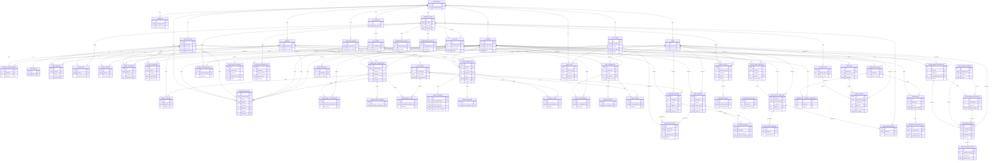

    # Full Application ERD

```mermaid
erDiagram
    ENTERPRISE {
        string id PK
        string enterprise_name
    }
    APP_USER {
        int id PK
        string full_name
        string email
        string role_name
        string status
    }
    COMPANY {
        int id PK
        string company_code
        string company_name
    }
    LOCATION {
        int id PK
        string location_code
        string location_name
        string state
    }
    FUND {
        int id PK
        string fund_code
        string fund_name
    }
    FUNCTION_MASTER {
        int id PK
        string function_code
        string function_name
    }
    PROJECT {
        int id PK
        string project_code
        string project_name
    }
    PROJECT_LOCATION_MAP {
        int id PK
        int project_id FK
        int location_id FK
    }
    FINANCIAL_YEAR {
        int id PK
        string fy_code
        date start_date
        date end_date
    }
    GRANT_MASTER {
        string id PK
        string grant_code
        string grant_name
        string grantor_name
    }
    GRANT_MOU {
        string id PK
        string grant_id FK
    }
    GRANT_BUDGET {
        string id PK
        string grant_id FK
        int project_id FK
        int location_id FK
    }
    GRANT_FUC {
        string id PK
        string grant_id FK
        int financial_year_id FK
    }
    GRANT_REPORT {
        string id PK
        string grant_id FK
        int project_id FK
    }
    GRANT_COA_MAP {
        string id PK
        string grant_id FK
        int ledger_id FK
    }
    GRANT_UTILIZATION {
        string id PK
        string grant_id FK
        int location_id FK
        int project_id FK
    }
    GRANT_ALLOCATION {
        string id PK
        string grant_id FK
        int location_id FK
        date period_start
        date period_end
    }
    TDS_RULE {
        int id PK
        int financial_year_id FK
        string section_code
        decimal tds_rate
    }
    COA_MASTER {
        int id PK
        string master_name
    }
    COA_GROUP {
        int id PK
        int coa_master_id FK
        string group_name
    }
    COA_LEDGER {
        int id PK
        int coa_group_id FK
        string ledger_name
        boolean is_party_account
    }
    EXPENSE_MAPPING {
        int id PK
        string expense_type
        int fund_id FK
        string grant_id FK
        int function_id FK
        int project_id FK
        int ledger_id FK
        int tds_rule_id FK
    }

    CONSULTANT_REQUISITION {
        string id PK
        string vendor_name
        int location_id FK
        int project_id FK
        int fund_id FK
        int tds_rule_id FK
    }
    CONSULTANT_TDS_ACCOUNT {
        string id PK
        string consultant_requisition_id FK
        int tds_rule_id FK
    }
    CONSULTANT_VOUCHER {
        string id PK
        string consultant_requisition_id FK
    }
    CONSULTANT_JV_MAP {
        string id PK
        string consultant_requisition_id FK
        int ledger_id FK
    }

    TRAVEL_REQUISITION {
        string id PK
        int user_id FK
        int location_id FK
        int project_id FK
        int fund_id FK
        string grant_id FK
        int function_id FK
    }
    TRAVEL_EXPENSE {
        string id PK
        string travel_requisition_id FK
        decimal actual_ticket_cost
        decimal actual_lodging_cost
        decimal actual_local_conveyance
    }
    TRAVEL_PER_DIEM_POLICY {
        string id PK
        int financial_year_id FK
        int location_id FK
    }
    TRAVEL_VOUCHER {
        string id PK
        string travel_requisition_id FK
    }
    TRAVEL_JV_MAP {
        string id PK
        string travel_requisition_id FK
        int ledger_id FK
    }

    RENT_REQUISITION {
        string id PK
        int location_id FK
        int fund_id FK
        int tds_rule_id FK
        string landlord_name
    }
    RENT_TDS_ACCOUNT {
        string id PK
        string rent_requisition_id FK
        int tds_rule_id FK
    }
    RENT_VOUCHER {
        string id PK
        string rent_requisition_id FK
    }
    RENT_JV_MAP {
        string id PK
        string rent_requisition_id FK
        int ledger_id FK
    }
    REQUISITION_APPROVAL {
        string id PK
        string source_type
        string source_id
        int approver_user_id FK
        string status
    }

    EXPENSE_VOUCHER {
        string id PK
        int location_id FK
        int fund_id FK
        int ledger_id FK
        string source_type
        string source_id
    }
    BANK_VOUCHER {
        string id PK
        int location_id FK
        int fund_id FK
        string payee_name
        string source_type
        string source_id
    }
    VOUCHER_APPROVAL {
        string id PK
        string voucher_type
        string voucher_id
        int approver_user_id FK
        string status
    }
    BANK_RECON_UPLOAD {
        string id PK
        int location_id FK
        date statement_date
    }
    BANK_RECON_MAP {
        string id PK
        string upload_id FK
        string bank_voucher_id FK
        string expense_voucher_id FK
    }
    CASHFLOW_TRANSACTION {
        string id PK
        int location_id FK
        int financial_year_id FK
        string source_type
        string source_id
    }
    BUDGET_ENTRY {
        string id PK
        int financial_year_id FK
        int location_id FK
        int fund_id FK
        int project_id FK
    }
    FORECAST_ENTRY {
        string id PK
        string budget_entry_id FK
        date forecast_month
    }

    FIXED_ASSET_PURCHASE {
        string id PK
        string asset_id
        int location_id FK
        int fund_id FK
        string vendor_name
    }
    FIXED_ASSET_REGISTER {
        string asset_id PK
        string purchase_id FK
        int location_id FK
        int fund_id FK
        string asset_type
    }
    FIXED_ASSET_DISPOSAL {
        string id PK
        string asset_id FK
        date disposal_date
    }
    DEPRECIATION_RATE_IT {
        string id PK
        int financial_year_id FK
        string asset_type
    }
    DEPRECIATION_RATE_CA {
        string id PK
        int financial_year_id FK
        string asset_type
    }
    DEPRECIATION_ENTRY {
        string id PK
        string asset_id FK
        int financial_year_id FK
    }

    BENEFICIARY_BATCH {
        string id PK
        int location_id FK
        string batch_number
    }
    BENEFICIARY {
        string id PK
        int location_id FK
        string batch_id FK
        string beneficiary_name
    }
    BENEFICIARY_FEE {
        string id PK
        int location_id FK
        decimal fee_amount
    }
    BENEFICIARY_COLLECTION {
        string id PK
        string beneficiary_id FK
        decimal amount_collected
        date collection_date
    }
    BENEFICIARY_FUNDER_ALLOCATION {
        string id PK
        string batch_id FK
        string grant_id FK
    }

    EMPLOYEE {
        int id PK
        int location_id FK
        string employee_name
        string department
    }
    PAYROLL_RUN {
        string id PK
        int financial_year_id FK
        string payroll_month
    }
    PAYROLL_ENTRY {
        string id PK
        string payroll_run_id FK
        int employee_id FK
        int fund_id FK
        decimal gross_salary
        decimal net_salary
    }

    PROCUREMENT_VENDOR {
        int id PK
        string vendor_name
        string category
        string status
    }
    PROCUREMENT_REQUISITION {
        int id PK
        int fund_id FK
        int project_id FK
        int requested_by_user_id FK
        decimal amount
    }
    PROCUREMENT_QUOTATION {
        int id PK
        int requisition_id FK
        int vendor_id FK
        decimal quote_amount
    }
    PURCHASE_ORDER {
        int id PK
        int requisition_id FK
        int vendor_id FK
        int quotation_id FK
        int fund_id FK
    }
    GOODS_RECEIPT_NOTE {
        int id PK
        int purchase_order_id FK
        date received_on
        string match_status
    }

    AUDIT_LOG {
        string id PK
        string table_name
        string record_id
        int action_by FK
        datetime action_at
    }

    ENTERPRISE ||--o{ APP_USER : has
    ENTERPRISE ||--o{ COMPANY : owns
    ENTERPRISE ||--o{ LOCATION : owns
    ENTERPRISE ||--o{ FUND : owns
    ENTERPRISE ||--o{ FUNCTION_MASTER : owns
    ENTERPRISE ||--o{ PROJECT : owns
    ENTERPRISE ||--o{ FINANCIAL_YEAR : owns
    ENTERPRISE ||--o{ GRANT_MASTER : owns
    ENTERPRISE ||--o{ TDS_RULE : owns
    ENTERPRISE ||--o{ COA_MASTER : owns
    ENTERPRISE ||--o{ EXPENSE_MAPPING : owns
    ENTERPRISE ||--o{ AUDIT_LOG : logs

    PROJECT ||--o{ PROJECT_LOCATION_MAP : spans
    LOCATION ||--o{ PROJECT_LOCATION_MAP : assigned_to

    COA_MASTER ||--o{ COA_GROUP : contains
    COA_GROUP ||--o{ COA_LEDGER : contains

    FINANCIAL_YEAR ||--o{ TDS_RULE : governs
    FUND ||--o{ EXPENSE_MAPPING : filters
    GRANT_MASTER ||--o{ EXPENSE_MAPPING : filters
    FUNCTION_MASTER ||--o{ EXPENSE_MAPPING : filters
    PROJECT ||--o{ EXPENSE_MAPPING : filters
    COA_LEDGER ||--o{ EXPENSE_MAPPING : posts_to
    TDS_RULE ||--o{ EXPENSE_MAPPING : taxes

    GRANT_MASTER ||--o{ GRANT_MOU : has
    GRANT_MASTER ||--o{ GRANT_BUDGET : has
    GRANT_MASTER ||--o{ GRANT_FUC : has
    GRANT_MASTER ||--o{ GRANT_REPORT : has
    GRANT_MASTER ||--o{ GRANT_COA_MAP : maps
    GRANT_MASTER ||--o{ GRANT_UTILIZATION : tracks
    GRANT_MASTER ||--o{ GRANT_ALLOCATION : allocates
    PROJECT ||--o{ GRANT_BUDGET : budgets
    LOCATION ||--o{ GRANT_BUDGET : budgets
    FINANCIAL_YEAR ||--o{ GRANT_FUC : reports
    PROJECT ||--o{ GRANT_REPORT : reports
    COA_LEDGER ||--o{ GRANT_COA_MAP : maps
    LOCATION ||--o{ GRANT_UTILIZATION : utilized_at
    PROJECT ||--o{ GRANT_UTILIZATION : utilized_for
    LOCATION ||--o{ GRANT_ALLOCATION : allocated_to

    LOCATION ||--o{ CONSULTANT_REQUISITION : requested_at
    PROJECT ||--o{ CONSULTANT_REQUISITION : charged_to
    FUND ||--o{ CONSULTANT_REQUISITION : funded_by
    TDS_RULE ||--o{ CONSULTANT_REQUISITION : taxed_by
    CONSULTANT_REQUISITION ||--o{ CONSULTANT_TDS_ACCOUNT : has
    CONSULTANT_REQUISITION ||--o{ CONSULTANT_VOUCHER : creates
    CONSULTANT_REQUISITION ||--o{ CONSULTANT_JV_MAP : maps
    TDS_RULE ||--o{ CONSULTANT_TDS_ACCOUNT : applies
    COA_LEDGER ||--o{ CONSULTANT_JV_MAP : posts_to

    APP_USER ||--o{ TRAVEL_REQUISITION : requests
    LOCATION ||--o{ TRAVEL_REQUISITION : occurs_at
    PROJECT ||--o{ TRAVEL_REQUISITION : charged_to
    FUND ||--o{ TRAVEL_REQUISITION : funded_by
    GRANT_MASTER ||--o{ TRAVEL_REQUISITION : grant_backed
    FUNCTION_MASTER ||--o{ TRAVEL_REQUISITION : functional_area
    TRAVEL_REQUISITION ||--o{ TRAVEL_EXPENSE : settles
    TRAVEL_REQUISITION ||--o{ TRAVEL_VOUCHER : creates
    TRAVEL_REQUISITION ||--o{ TRAVEL_JV_MAP : maps
    FINANCIAL_YEAR ||--o{ TRAVEL_PER_DIEM_POLICY : defines
    LOCATION ||--o{ TRAVEL_PER_DIEM_POLICY : applies_at
    COA_LEDGER ||--o{ TRAVEL_JV_MAP : posts_to

    LOCATION ||--o{ RENT_REQUISITION : occurs_at
    FUND ||--o{ RENT_REQUISITION : funded_by
    TDS_RULE ||--o{ RENT_REQUISITION : taxed_by
    RENT_REQUISITION ||--o{ RENT_TDS_ACCOUNT : has
    RENT_REQUISITION ||--o{ RENT_VOUCHER : creates
    RENT_REQUISITION ||--o{ RENT_JV_MAP : maps
    TDS_RULE ||--o{ RENT_TDS_ACCOUNT : applies
    COA_LEDGER ||--o{ RENT_JV_MAP : posts_to

    APP_USER ||--o{ REQUISITION_APPROVAL : approves

    LOCATION ||--o{ EXPENSE_VOUCHER : booked_at
    FUND ||--o{ EXPENSE_VOUCHER : booked_to
    COA_LEDGER ||--o{ EXPENSE_VOUCHER : ledger
    LOCATION ||--o{ BANK_VOUCHER : paid_from
    FUND ||--o{ BANK_VOUCHER : paid_from
    APP_USER ||--o{ VOUCHER_APPROVAL : approves
    EXPENSE_VOUCHER ||--o{ VOUCHER_APPROVAL : approval_flow
    BANK_VOUCHER ||--o{ VOUCHER_APPROVAL : approval_flow
    BANK_RECON_UPLOAD ||--o{ BANK_RECON_MAP : maps
    BANK_VOUCHER ||--o{ BANK_RECON_MAP : matches
    EXPENSE_VOUCHER ||--o{ BANK_RECON_MAP : matches

    LOCATION ||--o{ CASHFLOW_TRANSACTION : tracks
    FINANCIAL_YEAR ||--o{ CASHFLOW_TRANSACTION : tracks
    FINANCIAL_YEAR ||--o{ BUDGET_ENTRY : budgets
    LOCATION ||--o{ BUDGET_ENTRY : budgets
    FUND ||--o{ BUDGET_ENTRY : budgets
    PROJECT ||--o{ BUDGET_ENTRY : budgets
    BUDGET_ENTRY ||--o{ FORECAST_ENTRY : forecasts

    LOCATION ||--o{ FIXED_ASSET_PURCHASE : bought_at
    FUND ||--o{ FIXED_ASSET_PURCHASE : funded_by
    FIXED_ASSET_PURCHASE ||--|| FIXED_ASSET_REGISTER : creates
    LOCATION ||--o{ FIXED_ASSET_REGISTER : held_at
    FUND ||--o{ FIXED_ASSET_REGISTER : funded_by
    FIXED_ASSET_REGISTER ||--o{ FIXED_ASSET_DISPOSAL : disposed_by
    FINANCIAL_YEAR ||--o{ DEPRECIATION_RATE_IT : defines
    FINANCIAL_YEAR ||--o{ DEPRECIATION_RATE_CA : defines
    FIXED_ASSET_REGISTER ||--o{ DEPRECIATION_ENTRY : depreciates
    FINANCIAL_YEAR ||--o{ DEPRECIATION_ENTRY : posts

    LOCATION ||--o{ BENEFICIARY_BATCH : runs
    LOCATION ||--o{ BENEFICIARY : enrolls
    BENEFICIARY_BATCH ||--o{ BENEFICIARY : groups
    LOCATION ||--o{ BENEFICIARY_FEE : fee_policy
    BENEFICIARY ||--o{ BENEFICIARY_COLLECTION : pays
    BENEFICIARY_BATCH ||--o{ BENEFICIARY_FUNDER_ALLOCATION : funded_by
    GRANT_MASTER ||--o{ BENEFICIARY_FUNDER_ALLOCATION : funds

    LOCATION ||--o{ EMPLOYEE : employs
    FINANCIAL_YEAR ||--o{ PAYROLL_RUN : runs
    PAYROLL_RUN ||--o{ PAYROLL_ENTRY : contains
    EMPLOYEE ||--o{ PAYROLL_ENTRY : paid_to
    FUND ||--o{ PAYROLL_ENTRY : charged_to

    FUND ||--o{ PROCUREMENT_REQUISITION : budgets
    PROJECT ||--o{ PROCUREMENT_REQUISITION : for_project
    APP_USER ||--o{ PROCUREMENT_REQUISITION : requested_by
    PROCUREMENT_REQUISITION ||--o{ PROCUREMENT_QUOTATION : invites
    PROCUREMENT_VENDOR ||--o{ PROCUREMENT_QUOTATION : quotes
    PROCUREMENT_REQUISITION ||--o{ PURCHASE_ORDER : converts_to
    PROCUREMENT_VENDOR ||--o{ PURCHASE_ORDER : receives
    PROCUREMENT_QUOTATION ||--o| PURCHASE_ORDER : selected_as
    FUND ||--o{ PURCHASE_ORDER : charged_to
    PURCHASE_ORDER ||--o{ GOODS_RECEIPT_NOTE : received_as

    APP_USER ||--o{ AUDIT_LOG : acts
```
